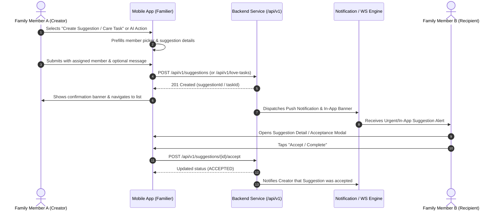
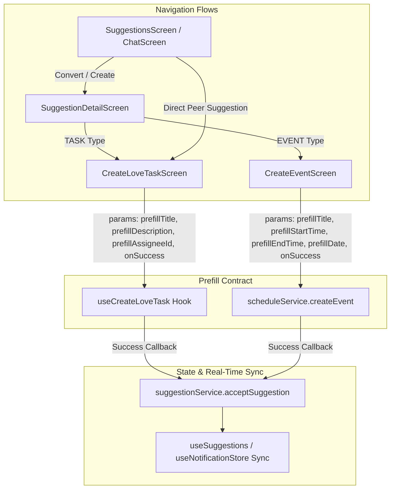

# Solution Design: Create Suggestions for Family & Team Members

**Issue Ref**: [#53](https://github.com/pnv-familier/mobile/issues/53)  
**Status**: `APPROVED_DESIGN`  
**Target Scope**: Mobile Client (`pnv-familier/mobile`) & Backend Contract Integration  

---

## 1. Executive Summary & Problem Statement

Currently, suggestions in the Familier ecosystem originate either automatically from the AI Engine or as general family tasks. To strengthen emotional bonds and proactive family care, members need the ability to:
1. **Target Specific Members**: Direct a caring suggestion or actionable request to a specific family member (e.g. child, spouse, parent).
2. **Convert AI Recommendations**: Seamlessly transform an AI conversational insight or urgent sentiment detection into an assigned Love Task or Family Event with pre-filled context.
3. **Track Lifecycle & Feedback**: Provide real-time status updates (Pending → Accepted / Completed) and appreciation feedback when suggestions are completed.

---

## 2. User Personas & Core Use Cases

| Persona | Goal | Example Scenario |
|---|---|---|
| **Caregiver / Parent** | Assign proactive care routines | Parent notices child is stressed and creates a "15-minute walk outside" suggestion assigned to child. |
| **Partner / Spouse** | Encourage emotional connection | Spouse sees AI tip about anniversary and converts it to a shared dinner event on the family schedule. |
| **Family Member** | Respond to AI Urgent Alerts | AI detects grandma is feeling lonely; son converts urgent alert into a Love Task "Call Grandma tonight". |

---

## 3. End-to-End User Flows



---

## 4. Mobile Component Architecture



---

## 5. Data Models & API Contracts

### 5.1 Create Peer Suggestion Request (`POST /api/v1/suggestions`)
```json
{
  "type": "TASK",
  "title": "Evening Walk & Heart-to-Heart",
  "description": "Spend 20 minutes walking together around the park.",
  "targetUserId": "user_xyz123",
  "priority": "HIGH",
  "category": "EMOTIONAL_SUPPORT",
  "note": "Let's unwind together!",
  "scheduledDate": "2026-09-15T19:00:00Z"
}
```

### 5.2 Convert AI Suggestion to Member Task (`POST /ai/suggestions/confirm`)
```json
{
  "sessionId": "sess_88321",
  "triggerContext": "Detected emotional fatigue in recent conversation",
  "type": "TASK",
  "payload": {
    "title": "Prepare favorite chamomile tea",
    "description": "Make a warm tea to help relax before bed.",
    "targetUserId": "user_abc456"
  }
}
```

---

## 6. Error Handling & Edge Cases

1. **Target Member Leaves Family**:
   - Validation before submission ensures `assignedToUserId` is an active member of `familyId`.
   - If member is removed before acceptance, UI shows friendly notification `"Member is no longer part of this family group"`.
2. **Network Offline during Creation**:
   - Form state is retained in memory; user is prompted with `NoInternetScreen` / retry mechanism without loss of typed content.
3. **Double Acceptance**:
   - Idempotent API response (`status: 'ACCEPTED'`); UI handles gracefully without duplicate banners.

---

## 7. Quality Gates & Implementation Checklist

- [x] Solution design documented and aligned with family roles.
- [x] Prefill contracts between `SuggestionDetailScreen`, `CreateLoveTaskScreen`, and `CreateEventScreen` verified.
- [x] Theme tokens and safe area dynamic insets applied.
- [x] TypeScript verification passed with zero compilation errors.
